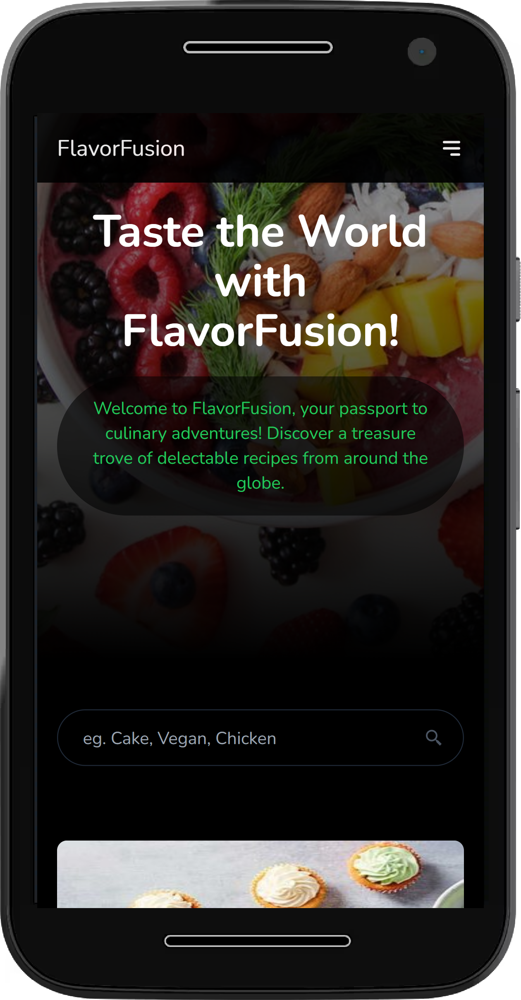

# FlavorFusion

The "FlavorFusion" app is a dynamic and user-friendly web application built using React and styled with Tailwind CSS. This app provides a seamless experience for exploring and discovering various food dishes. "FlavorFusion" delivers a delightful and informative culinary journey, offering users the ability to explore, learn, and make well-informed choices about their food preferences. Whether users are looking for nutritional insights, ingredient details, or new dishes to try, the app provides a user-friendly interface that caters to their needs and preferences.


## Screenshots

### Desktop View


### Mobile View
<p align="center">
  
</p>
<p align="center">
  
</p>


## Technologies Used

- React:
- Tailwind CSS: 
- React Router: 
- Vercel


## Features

1. **Infinite Scroll with Show More Button:** The app employs an infinite scroll feature, allowing users to explore a wide range of food dishes effortlessly. As users scroll through the list, the app automatically loads more content when the "Show More" button is clicked. 

2. **Individual Dish Pages:** Each food dish is showcased on its own dedicated page. Users can click on a dish to access detailed information, including nutritional facts and a comprehensive list of ingredients. This approach provides a comprehensive view of the selected dish's attributes.

3. **Nutritional Information and Ingredients:** For each food dish, the app presents a clear and organized display of its nutritional information, ensuring that users can make informed choices about their meals. The ingredient list offers a breakdown of components, enhancing users' understanding of the dish's composition.

4. **Related Food Items:** The individual dish pages also offer information about related food items. This feature enhances users' culinary exploration by suggesting other dishes that share similar attributes or ingredients, encouraging them to discover new flavors.

5. **Search Functionality:** The app features a robust search functionality that empowers users to quickly find specific dishes or ingredients. The search bar delivers relevant results in real-time as users type.

6. **Responsive Design:** The app is designed with a responsive layout to ensure a seamless experience across various devices, including mobile phones and tablets. Users can access and interact with the app's features and content regardless of their screen size.


## Run Locally

Clone the project

```bash
https://github.com/dev-akhilesh/FlavorFusion.git
```

Install dependencies

```bash
  npm install
```

Start the server

```bash
  npm run start
```


